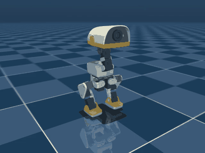

# Neutral-head Flamingo distillation

This experiment asks a narrow question: can Microduck retain the mature
Flamingo leg controller while every learned head action is replaced by the
neutral `HOME` target?

The answer in this MuJoCo evaluation is **yes**. A lightweight final-layer
distillation produced one ONNX actor that completed a left-foot hold followed
by a right-foot hold, with each command held for 10 seconds.



[Static contact sheet](media/contact_sheet.png)

The full rollout is in
[`media/neutral_head_left_then_right.mp4`](media/neutral_head_left_then_right.mp4).

## Result

| Measurement | Result | Acceptance |
|---|---:|---:|
| Left-foot single-support fraction | 100% | >= 95% |
| Right-foot single-support fraction | 99% | >= 95% |
| Raised right-foot median height | 9.67 cm | >= 5 cm |
| Raised left-foot median height | 7.64 cm | >= 5 cm |
| Final two-foot contact fraction | 100% | >= 95% |
| Non-foot ground-contact samples | 0 | 0 |
| Maximum trunk tilt | 27.93 deg | < 60 deg |

The command timeline is: stand, hold on the left foot for 10 seconds, return to
stand, hold on the right foot for 10 seconds, then return to stand. The first
two seconds of each hold are treated as transition time; contact acceptance is
measured over the remaining eight seconds.

Machine-readable evidence is committed in [`results/summary.json`](results/summary.json)
and [`results/telemetry.csv`](results/telemetry.csv).

## Method

The teacher is Pollen Robotics' published
[`RemiFabre/microduck-flamingo-cycle`](https://huggingface.co/RemiFabre/microduck-flamingo-cycle)
policy. During data collection, its leg actions are applied while head actions
5 through 8 are replaced with zero, which means `HOME` for this controller.

[`scripts/distill_final_layer.py`](scripts/distill_final_layer.py) keeps the
teacher's observation normalizer and hidden layers. It fits only the final
linear layer with ridge regression against the fixed-head rollout, anchored to
the original final-layer weights. Finally, all four head-output rows are set
exactly to zero. This is supervised policy distillation, not PPO retraining.

The frozen teacher data used for the committed model is included as
[`data/fixed_head_teacher_rollout.npz`](data/fixed_head_teacher_rollout.npz).

## Reproduce the model

Run these commands from the repository root on the `flamingo` codebase:

```bash
uv run scripts/publish_policy.py fetch \
  RemiFabre/microduck-flamingo-cycle \
  --to /tmp/microduck-flamingo-teacher

uv run experiments/neutral_head_flamingo/scripts/distill_final_layer.py \
  --teacher-onnx /tmp/microduck-flamingo-teacher/policy.onnx \
  --data experiments/neutral_head_flamingo/data/fixed_head_teacher_rollout.npz \
  --output /tmp/neutral_head_flamingo.onnx \
  --ridge 25

shasum -a 256 /tmp/neutral_head_flamingo.onnx
```

Expected model digest:

```text
ca1d39539074655ad344bcf95cffb352215ba1d25b444c315cebf8a792a63e5f
```

## Re-run the evaluation

```bash
uv run experiments/neutral_head_flamingo/scripts/evaluate_policy.py \
  --worktree . \
  --policy experiments/neutral_head_flamingo/policy/neutral_head_flamingo.onnx \
  --output-dir /tmp/neutral-head-evaluation \
  --long-hold \
  --left-first
```

On macOS, rendering may require `mjpython` as described in the repository's
policy-sharing documentation. Add `--no-video` for telemetry-only evaluation.

## Important limitation

"Neutral head" describes the **commanded actuator targets**, not a physically
rigid head. The simulator still permits passive joint deflection under load.
During the accepted rollout, observed joint ranges were 0.0956 rad neck pitch,
0.0563 rad head pitch, 0.0399 rad head yaw, and 0.0117 rad head roll. A separate
rigid-joint test failed, so this experiment does not claim that Microduck can
balance with its head mechanically locked.

## Provenance and safety

- Base repository revision: `4757d6aed51ff059232a66cdb8a4ee3a77fa2ce8`
  from `pollen-robotics/microduck_rl` branch `flamingo`.
- Teacher/model metadata points to Flamingo cycle checkpoint `model_2499.pt`.
- Teacher and repository are used under Apache-2.0; see the root `LICENSE` and
  [`THIRD_PARTY_NOTICE.md`](THIRD_PARTY_NOTICE.md).
- This is a simulation result. Validate torque limits, fall handling, and a
  physical kill switch before attempting deployment on hardware.
